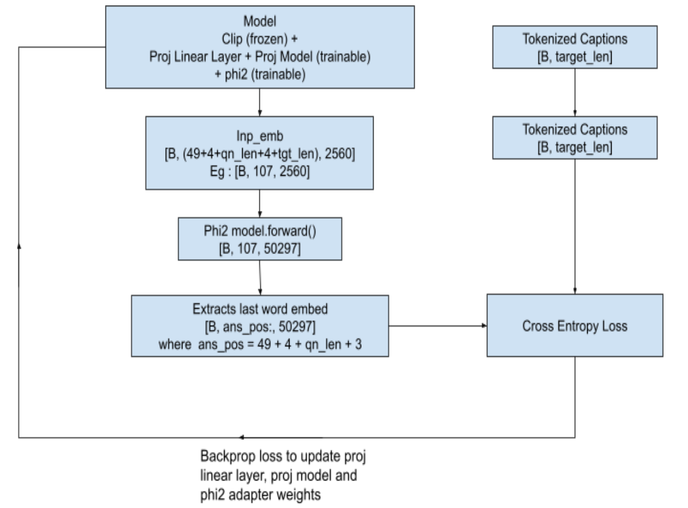
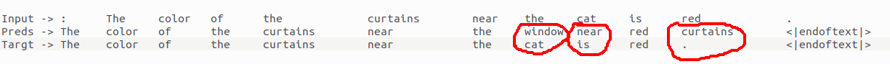

# Jñāna - Phi2 Multiomodal Conversation Agent

## Table of Contents

- [Huggingface space](#huggingface-space)
- [Introduction](#introduction)
- [Stage 0 : Attempting to train phi2 from scratch](#stage-0-attempting-to-train-phi2-from-scratch)
- [Stage 1 : Training the projection models](#stage-1-training-the-projection-models)
- [Stage 2 : Fine tuning the projection models and phi2](#stage-2-fine-tuning-the-projection-models-and-phi2)
- [Stage 3 - Integrating audio and building Jñāna - huggingface spaces app ](#stage-3-integrating-audio-and-building-jñāna-huggingface-spaces-app)
- [Budget](#budget)
- [Credits](#credits)
- [My Linkedin](#contact)

### Huggingface space
- https://huggingface.co/spaces/neuralorbs/

### Introduction
[Back to top](#table-of-contents)
- **Jñāna-Phi2-Multimodal-Conversation-Agent** is a gradio app hosted on huggingface spaces
- Jñāna is capable of accepting inputs in the form of image/audio/text and a combination of any of these 3
- Jñāna uses **microsoft/phi2** LLM model that was trained based on **Llava 1.0** and **Llava 1.5** 
- qlora strategy was used for fine-tuning microsoft/phi2 
- Training strategy and building Hugging face app is detailed in the below sections that follow.
### Stage 0 Attempting to train phi2 from scratch
[Back to top](#table-of-contents)
- In this stage, microsoft-phi2 was build from scratch using customized [config.py](phi2_fullmodel_4gpus_train_from_scratch/config.py) based on [lit-gpt](https://github.com/Lightning-AI/lit-gpt/tree/main/lit_gpt)
- Script for training can be seen in [main_script.py](phi2_fullmodel_4gpus_train_from_scratch/main_script.py)
- 4 RTX 3090 GPUs (24GB VRAM each) were used to train the model using Redpajama dataset
- Loss came down from 10.9637 to 6.2671 in 2100 iterations
- Logs can be seen in [Stage-0 Training Logs](phi2_fullmodel_4gpus_train_from_scratch/phi2_2.7b_results)
- If trained further, better convergence will be reached but due to compute requirements this approach was not pursued
- Instead, it was decided to fine-tune the pretrained phi2 available in huggingface
- Code and scripts used for training can be seen here [Stage 0 Training Files](phi2_fullmodel_4gpus_train_from_scratch)
### Stage 1 Training the projection models
[Back to top](#table-of-contents)
- Our objective is to build a multimodal LLM
- Multimodal means LLM should be capable to accept inputs in forms additional to usual text format
- In our case, we are attempting to equip LLM to accept image and audio inputs apart from the text
- We will use microsoft/phi2 as our LLM here.
- But phi2 is textual LLM which means it needs text tokens as input. 
- It doesn't have innate capabilities to accept image or audio as input.
- So we have to convert image and audio to a format that phi2 can accept and understand.
- In stage-1, we will deal with converting image to an embedding format that phi2 can accept and process.
- Refer the flow-chart below to understand the overall flow:
    
- We will pass the image to a CLIP model - openai/clip-vit-base-patch32
- We will take the image embeddings from CLIP - one before projection layer whose shape is [50, 768]
- As suggested in [Llava1.0 paper](https://arxiv.org/pdf/2304.08485.pdf) we will discard the 1st layer that has CLS embeddings and retain [49, 768]
- We will pass this [49, 768] through a linear layer that will convert Clip embeddings to phi2 embedding dimensions i.e. from [49, 768] to [49, 2560]
- We will then pass this [49, 2560] through a projection model (Reference : [Llava 1.5 Simple Res Block](https://github.com/haotian-liu/LLaVA/blob/main/llava/model/multimodal_projector/builder.py)
)
- This projection model is responsible for making clip embeddings understandable to the phi2
- In other words, projection model will capture the meaning of image and share it with phi2
- phi2 used is pre-trained version from [HF](https://huggingface.co/microsoft/phi-2) and in this stage we wont fine-tune phi2
- Same goes for Clip as well i.e. phi2 and clip weights will remain frozen while projection linear layer and projection weights will get trained
- Projection model will give us [49, 2560] as output
- We will append an end-of-image token to this [49, 2560] to indicate that image embeddings ended
- We used the text *"caption image:"* as end-of-image string
- This EOI string was tokenized using [microsoft/phi2](https://huggingface.co/microsoft/phi-2) tokenizer
- These integer tokens were passed through input-embed layer of pretrained phi2 model to get [4, 2560] where 2560 is the phi2 embedding dimension
- Then, [4, 2560] will be appended with the [49, 2560] that we got from projection model to give [53, 2560]
- We will pass this [53, 2560] embeddings to phi2 forward method again & again until the caption length of image is matched as seen below
- We will extract the last layers correpsonding to the caption and compare it with ground truth caption for loss calculation
- Loss is backpropagated, projection linear layer and projection model weights updated and next batch picked-up
- Training loop is as shown below
    
- Dataset we are using here is [instruct150K](https://huggingface.co/datasets/liuhaotian/LLaVA-Instruct-150K) which have ~ 81K [coco train 2017 images](https://cocodataset.org/#download)
    - coco dataset can be manually downloaded using ```!wget http://images.cocodataset.org/annotations/annotations_trainval2017.zip```
- Captions are taken from coco train2017 dataset
- Training was done on ~30K images out of 81K on A100 (40GB VRAM gpu) and stopped when loss value dropped from 9.8783 to 1.1321
- Teacher-forcing was used while training to help faster convergence and batch-size used was 2
- This training consumed approximately 200 GPU compute units in google colab
- Details of training can be seen in *'Teacher forcing + Calling embeddings each time with EOI token as "caption image:" for 81K images'* section in the colab notebook [ERA1_s29_stage1_experiment_v1.ipynb](https://colab.research.google.com/drive/1j17OBTrUNPymIxieYZ7aoHAaViiVhCft#scrollTo=AuRtmzNLeov1)
### Stage 2 Fine tuning the projection models and phi2
[Back to top](#table-of-contents)
- Pretrained phi2 is capable of only generating text
- We have to fine-tune phi2 to engage in a conversation i.e when asked a query it should be able to answer it sensibly
- In stage 1, we trained projection model which gives us now meaningful context about the image
- Now, we will append the [53, 2560] that we get from projection model with query embeddings and generate the answer
- This answer will be compared with the ground truth answer
- In stage2, we will fine-tune the phi2 so that it will become capable to handle a conversation
- We will also fine-tune the projection linear layer and projection model so that they continue to learn about the images from the conversation data also
- To stay within the memory constraints, phi2 will be downloaded in 4-bits and trained using peft-qlora strategy
- peft-qlora strategy will add adapter weights on top of the pretrained phi2 model which comes to be around just 3% of total weights ```trainable params: 94,371,840 || all params: 2,869,421,175 || trainable%: 3.2888807269640368``` which is  light-weight and manageable
- Unlike stage 1, stage 2 was trained with a single model.forward() call to phi2 making it memory efficient
    
- For an answer of 30 tokens, training happens as below:
    - Input ``` + <EOI [B, 4, 2560]> + <Qn [B, 20, 2560]> + <EOQ [B, 4, 2560]> + <Ans [B, 30, 2560]>```
        - ```<EOI [B, 4, 2560]>``` -> EOI used is same as in stage-1 i.e. *"caption image:"*
        - ```<EOQ [B, 4, 2560]>``` -> EOQ i.e End Of Question used is *"end of question:"*
    - Input shape ```[B, 107, 2560]```
    - Input goes to ```model.forward()```
    - Gets back logits of ```[B, 107, 50257]```
    - preds = Take final token of EOQ + last 30 tokens ```[B, 76:, 50257]```
    - Add End-of-Sentence "<|endoftext|>" token to the answer target
    - Compare preds with target for loss calculation
- Loss calculation happens as below. Shown below is for a single batch but it can scale to any number of batches.
    
    - In this example, when last token of EOS which ":" is encountered, model is expected to predict first word of the answer which is "The"
    - Similarly when "The" is seen, model should predict "color" and so on
    - Finally when "." is seen, model should predict "<|endoftext|>"
    - As we can see, in the image above except for 3 tokens (circled in red), model got it correct
- Loss used is cross-entropy loss here as well
- Training was done on [instruct150K](https://huggingface.co/datasets/liuhaotian/LLaVA-Instruct-150K) dataset
- In stage-1 we trained instruct150k images against coco-captions, whereas here we will use the images with question/answer format present in instruct150k for training objective is to make phi2 capable for conversations
- Instruct150k conversation were broken down into question-answer format and in total 3_56_752 records were there
- This json format was sorted based on ascending order of answer length
- Then, answer lengths upto 119 tokens that comprises 2_60_564 records were trained against T4 GPU (15 GB VRAM) in different batches as shown below:
    - Different batch_sizes were choosen to avoid OOM issues
    - Answer length 1 to 11 : 45557 records : bs = 10
    - Answer length 12 to 17: 53028 records : bs = 10
    - Answer length 18 to 23: 44613 records : bs = 9    
    - Answer length 24 to 40: 52452 records : bs = 8
    - Answer length 41 to 59: 13482 records : bs = 6
    - Answer length 60 to 79: 21832 records : bs = 5
    - Answer length 80 to 99: 16162 records : bs = 4
    - Answer length 100 to 119: 28228 records : bs = 4
- This training consumed approximately 110 GPU compute units in google colab
- Training loss started at 3.634 at first batch and came down to 1.2028 at the final batch
- Once training was done, fine-tuned **phi2 qlora model** was merged with [existing huggingface microsoft/phi2 model](https://huggingface.co/microsoft/phi-2)
- This new model available in HF as [anilbhatt1/phi2-proj-offset-peft-model](https://huggingface.co/anilbhatt1/phi2-proj-offset-peft-model) was used for inferencing in the Huggingface Spaces
- Details of stage-2 training can be seen in the colab notebook [ERA1_s29_stage2_experiment_v1.ipynb](https://colab.research.google.com/drive/1Zv04sfkJxuXfopK6lvZeqaNZw7sa-Jh1#scrollTo=bvYoUkYZUkkX)
### Stage 3 Integrating audio and building Jñāna  huggingface spaces app 
[Back to top](#table-of-contents)
- In stage 2, we equipped our model to accept an image and strike a conversation based on that image or textual query we supply
- However, our objective is to have our app be capable of handling audio query as well
- There are 2 ways to deal with audio:
    - Develop a projection model and train like we did in stage-1 and integrate it with phi2
    - Take an already available audio model, feed the audio to this model, get the text as output and feed this text as a query to multimodal LLM model
- We will follow the latter approach i.e. using an existing audio model
- We will use the [whisperx model](https://github.com/m-bain/whisperX) for this purpose
- Below portion of code will accept the audio, convert it to text and tokenize it to feed to our stage-2 trained model  
    ```
        !pip install -q git+https://github.com/m-bain/whisperx.git
        import whisperx
        audio_model = whisperx.load_model("small", "cuda", compute_type="float16")
        audio_result = audio_model.transcribe(audio)
        audio_text = ''
        for seg in audio_result['segments']:
            audio_text += seg['text']
        audio_text = audio_text.strip()
        audio_tokens = tokenizer.encode(audio_text)
    ```
- Then we will prepare the input_embed as below as applicable in below sequence:
    - image embed [49, 768] (if image) + eoi [4, 768] + audio-qn embed (if audio) + text-qn embed (if text) + eoq [4, 768]
- This input_embed is fed to model to generate text as below:
    ```
        max_len = 200
        output = self.phi2_model.generate(inputs_embeds=input_embed,
                                          max_new_tokens=max_len,
                                          return_dict_in_generate = True,
                                          bos_token_id=bos_token_id,
                                          pad_token_id=bos_token_id,
                                          eos_token_id=bos_token_id)
    ```
- Details of inferencing tried in google colab can be found in [ERA1_s29_Gradio_v1.ipynb](https://colab.research.google.com/drive/19Mz4UgI9KOApXzGgKP-TqGMOmuUlekkF#scrollTo=pTqOsfWcD9iN)
- Huggingface code can be seen in [app.py](app.py)
- HF spaces code can also be seen in [Jñāna files section](https://huggingface.co/spaces/neuralorbs/Jnana-Phi2-Multimodal-Conversation-Agent/tree/main)
### Budget
[Back to top](#table-of-contents)
- This costed me roughly ₹4000 (close to $50) to develop this LLM apart from my 3 weeks personal effort
- ~ $12 for 4 RTX 3090 GPUs to train phi2 from scratch on stage-0
- ~ $26 for A100 compute units to train proj model on stage-1
- ~ $12 for T4 compute units to fine-tune proj model and phi-2 on stage-2
- Inferencing was experimented in free colab T4 GPU.
### Credits
[Back to top](#table-of-contents)
- [Rohan Shravan](https://www.linkedin.com/in/rohanshravan/), [The School of A.I.](https://theschoolof.ai/)
- [whisperX](https://github.com/m-bain/whisperX)
- [Llava 1.0 paper](https://arxiv.org/pdf/2304.08485.pdf)
- [Llava github](https://github.com/haotian-liu/LLaVA/tree/main)
- [GPT LLM trainer](https://github.com/mshumer/gpt-llm-trainer)
- [HF PEFT training pytorch example](https://github.com/huggingface/peft/tree/main/examples/multilayer_perceptron)
### My Linkedin
- Connect me in linkedin at [Anil Bhatt](www.linkedin.com/in/anilkumar-n-bhatt)