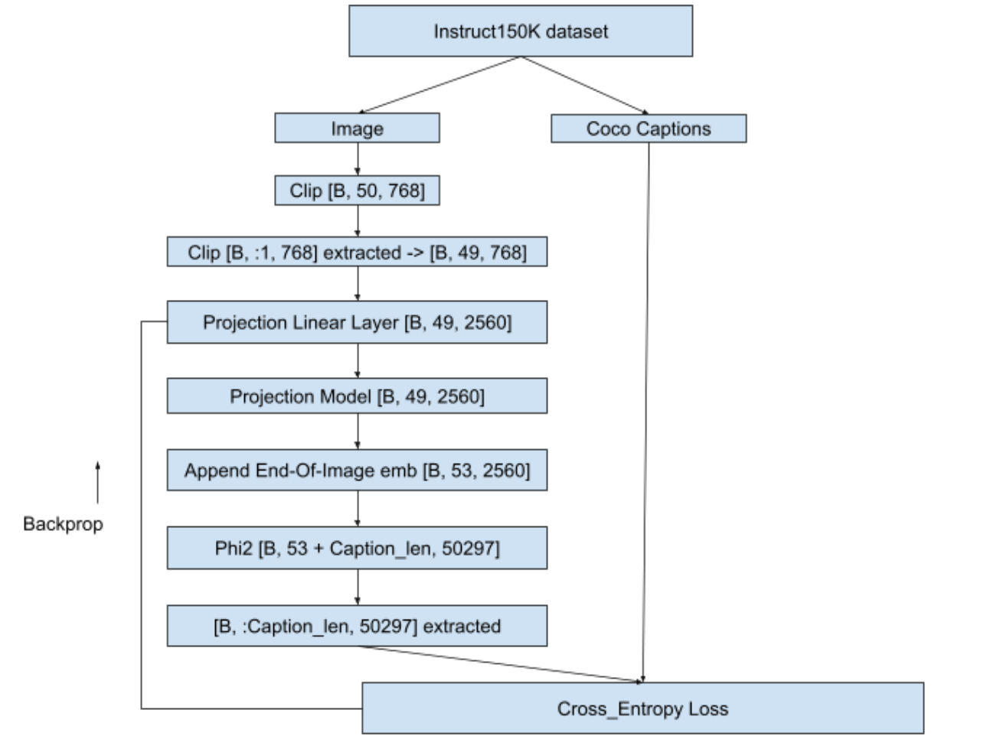
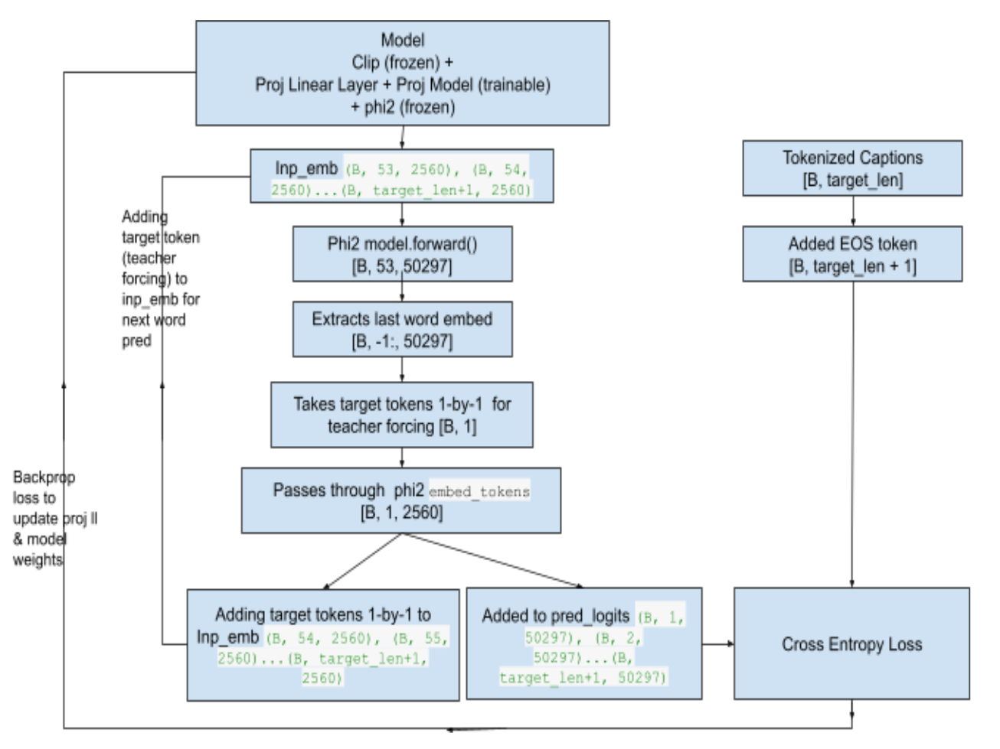

# Jñāna - Phi2 Multiomodal Conversation Agent

### Huggingface space : https://huggingface.co/spaces/neuralorbs/
### Introduction
- **Jnana-Phi2-Multimodal-Conversation-Agent** is a gradio app hosted on huggingface spaces
- Jnana is capable of accepting inputs in the form of image/audio/text and a combination of any of these 3
- Jnana uses **microsoft/phi2** LLM model that was trained based on **Llava 1.0** and **Llava 1.5** 
- qlora strategy was used for fine-tuning microsoft/phi2 
- Training strategy is detailed in the below sections that follow.
### Stage 0 - Attempting to train phi2 from scratch
- In this stage, microsoft-phi2 was build from scratch using customized [config.py](phi2_fullmodel_4gpus_train_from_scratch/config.py) based on [lit-gpt](https://github.com/Lightning-AI/lit-gpt/tree/main/lit_gpt)
- Script for training can be seen in [main_script.py](phi2_fullmodel_4gpus_train_from_scratch/main_script.py)
- 4 RTX 3090 GPUs (24GB VRAM each) were used to train the model using Redpajama dataset
- Loss came down from 10.9637 to 6.2671 in 2100 iterations
- Logs can be seen in [Stage-0 Training Logs](phi2_fullmodel_4gpus_train_from_scratch/phi2_2.7b_results)
- If trained further, better convergence will be reached but due to compute requirements this approach was not pursued
- Instead, it was decided to fine-tune the pretrained phi2 available in huggingface
- Code and scripts used for training can be seen here [Stage 0 Training Files](phi2_fullmodel_4gpus_train_from_scratch)
### Stage 1 - Training the projection models
- Our objective is to build a multimodal LLM
- Multimodal means LLM should be capable to accept inputs in forms additional to usual text format
- In our case, we are attempting to equip LLM to accept image and audio inputs apart from the text
- We will use microsoft/phi2 as our LLM here.
- But phi2 is textual LLM which means it needs text tokens as input. 
- It doesn't have innate capabilities to accept image or audio as input.
- So we have to convert image and audio to a format that phi2 can accept and understand.
- In stage-1, we will deal with converting image to an embedding format that phi2 can accept and process.
- Refer the flow-chart below to understand the overall flow:
    
- We will pass the image to a CLIP model - openai/clip-vit-base-patch32
- We will take the image embeddings from CLIP - one before projection layer whose shape is [50, 768]
- As suggested in [Llava1.0 paper](https://arxiv.org/pdf/2304.08485.pdf) we will discard the 1st layer that has CLS embeddings and retain [49, 768]
- We will pass this [49, 768] through a linear layer that will convert Clip embeddings to phi2 embedding dimensions i.e. from [49, 768] to [49, 2560]
- We will then pass this [49, 2560] through a projection model (Reference : [Llava 1.5 Simple Res Block](https://github.com/haotian-liu/LLaVA/blob/main/llava/model/multimodal_projector/builder.py)
)
- This projection model is responsible for making clip embeddings understandable to the phi2
- In other words, projection model will capture the meaning of image and share it with phi2
- phi2 used is pre-trained version from [HF](https://huggingface.co/microsoft/phi-2) and in this stage we wont fine-tune phi2
- Same goes for Clip as well i.e. phi2 and clip weights will remain frozen while projection linear layer and projection weights will get trained
- Projection model will give us [49, 2560] as output
- We will append an end-of-image token to this [49, 2560] to indicate that image embeddings ended
- We used the text *"caption image:"* as end-of-image string
- This EOI string was tokenized using [microsoft/phi2](https://huggingface.co/microsoft/phi-2) tokenizer
- These integer tokens were passed through input-embed layer of pretrained phi2 model to get [4, 2560] where 2560 is the phi2 embedding dimension
- Then, [4, 2560] will be appended with the [49, 2560] that we got from projection model to give [53, 2560]
- We will pass this [53, 2560] embeddings to phi2 forward method again & again until the caption length of image is matched as seen below
- We will extract the last layers correpsonding to the caption and compare it with ground truth caption for loss calculation
- Loss is backpropagated, projection linear layer and projection model weights updated and next batch picked-up
- Training loop is as shown below
    
- Dataset we are using here is [instruct150K](https://huggingface.co/datasets/liuhaotian/LLaVA-Instruct-150K) which have ~ 81K [coco train 2017 images](https://cocodataset.org/#download)
    - coco dataset can be manually downloaded using ```!wget http://images.cocodataset.org/annotations/annotations_trainval2017.zip```
- Captions are taken from coco train2017 dataset
- Training was done on ~30K images out of 81K on A100 (40GB VRAM gpu) and stopped when loss value dropped from 9.8783 to 1.1321
- Teacher-forcing was used while training to help faster convergence and batch-size used was 2
- Details of training can be seen in *'Teacher forcing + Calling embeddings each time with EOI token as "caption image:" for 81K images'* section in the notebook [Stage1 Training Notebook](ERA1_s29_stage1_experiment_v1.ipynb)
